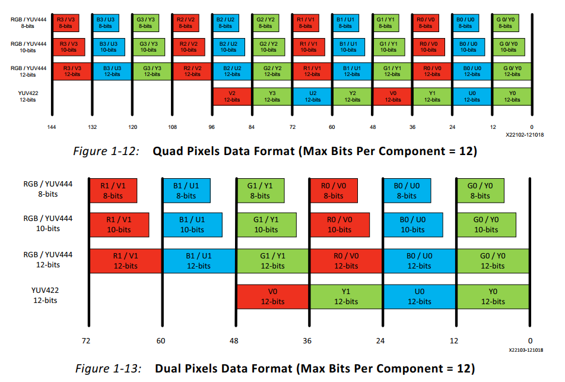
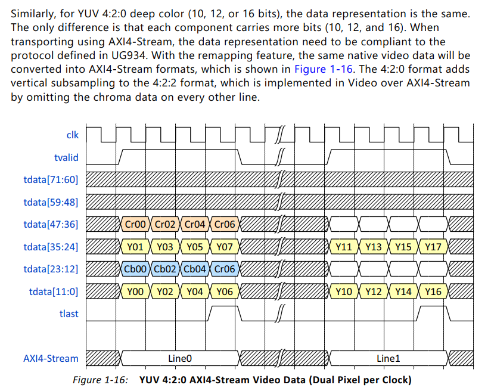

### discription:

图像缩放IP测试，目前已支持多种图像格式

### history:

* 2022.6.18	已验证RGB格式，1ppc,8bit width,行和列缩放功能正常
* 2022.6.22	增加YUV4:2:2与YUV4:2:0格式降采样

### detail:

在AXI Stream总线上传输的图像格式如下（截取了部分格式图片）可参考ug934_axi_videoIP.pdf

对于YUV 4:2:0,如图其传输方式在偶数行上与YUV4:2:2一样，在奇数行上则只传输亮度Y,丢掉色度信息

