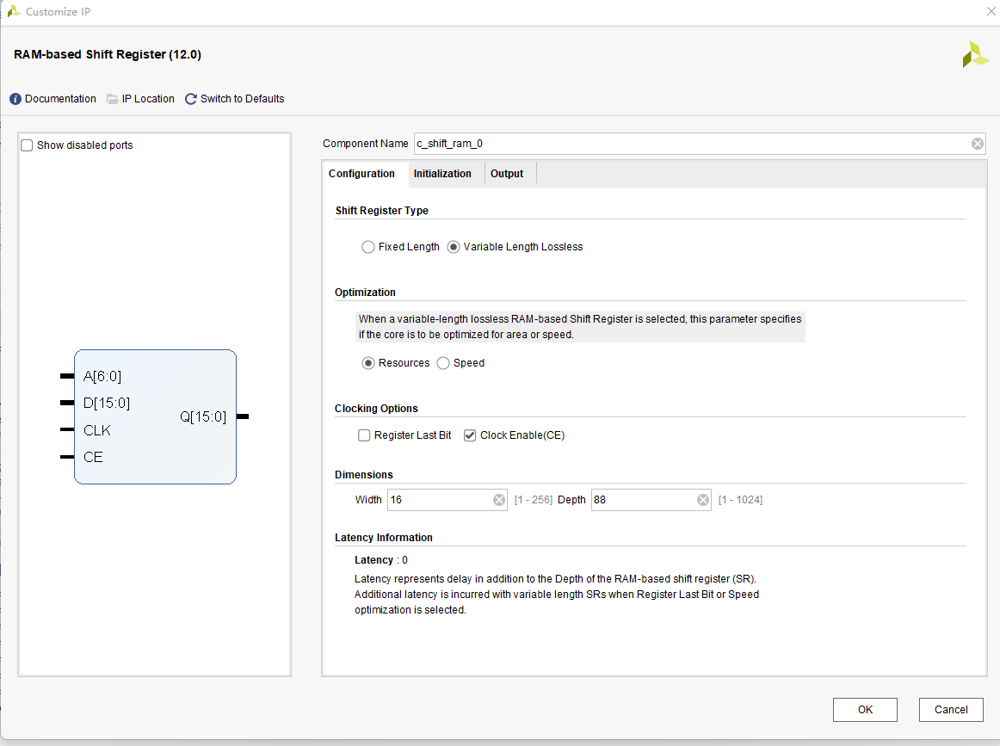
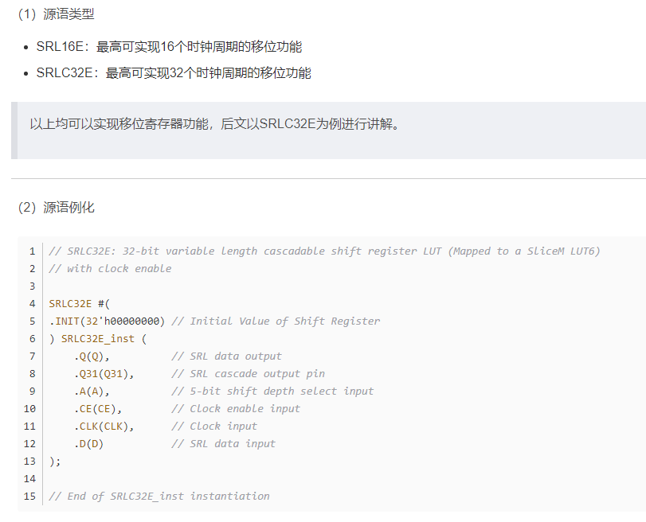

3*3矩阵生成模块

通过使用ram IP核实现，方便移植

在intel平台下，通过shift ram和ram两种方式，也可修改其底层原语进行扩展

在Xilinx平台下

方法1：

Xilinx也有移位寄存器的IP

方法2：使用SRLC32E原语

可参考此博客：https://wuzhikai.blog.csdn.net/article/details/124970484

    在FPGA的底层结构----可配置逻辑块CLB中，一个CLB由4个Slice组成，这4个Slice又可以分SliceM和SliceL（其比例大致为1:3），其中M是Memory的首字母，L是Logic的首字母，比较SliceM和SliceL，其区别就是SliceM的查找表具有RAM和ROM的功能，而SliceL的则不具备，所以SliceM比SliceL多的功能就是做存储器和移位。

方法3：

除了直接例化SRL源语外，也可以通过编写常规的RTL代码来实现移位寄存器的功能。但是需要注意的是，要注意编写RTL的风格，有些风格可能导致vivado无法综合出SRL，而是使用多个REG来实现，会造成大量的资源浪费。
