此版本为使用quartus 18.1版本中shift ram生成3X3矩阵

图像仿真+median中值滤波+sobel边沿检测

其中使用alter的shift ram IP生成3*3矩阵进行相应运算

仿真图片修改testbeech中此处

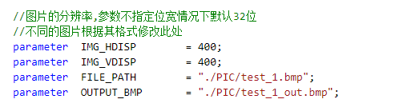

已测可仿真4030*3024的图片，图片分辨率越大处理时间越长

### cmos_clken

该信号主要取决于像素时钟速率和像素速率

**（**1**） 时钟速率大于像素速率， 如下图所示：**

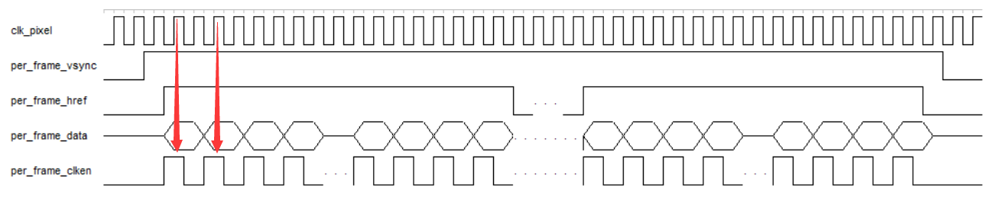

**这种情况，正如前面 **OV5640 **，假设输入 **24MHz **像素时钟，但实际拼接后像素数**据的速率为 **12MHz（1个clock输入1 byte数据，2个clock才合成一个RGB565格式像素数据）**， **

**时钟速率**>**数据速率。 此时需要额外的 **per_frame_clken **使能时钟， 并且 **per_frame_clk **有效边沿与数据的中间对齐。 总之， 使能时钟必须保证后续数据在 **clken **有效边沿

读取， 一行 **640 **个有效边沿（根据分辨率变化）。

**（ **2**） 时钟速率等于像素速率，如下图所示：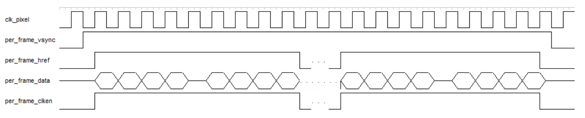**

**比如外部输入的是 **8Bit **灰度数据，或者 **RAW **阵列，此时时钟速率等于像素**数据的速率， 因此在行有效期间， **clken **信号一直有效，且保持 **640 **个有效周期
（ 根据分辨率变化） 。

本例中直接从bmp图片中取数据，故满足第二种情况，assign cmos_clken = cmos_href;//一个clock,一个data

### 3*3矩阵

本例中生成3*3矩阵通过调用altera的shift ram IP核，寄存两行数据实现，在将得到的3行1列数据打三拍从而得到3行3列矩阵

在对图像做卷积操作时要使输入输出大小一样，则肯定会涉及Padding

如下图所示：

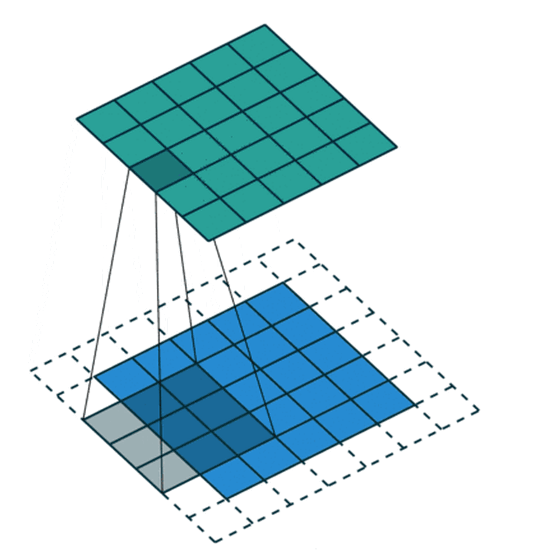

在程序中使上方前两行和左侧前两列padding为0，如下图所示（画的比较丑）

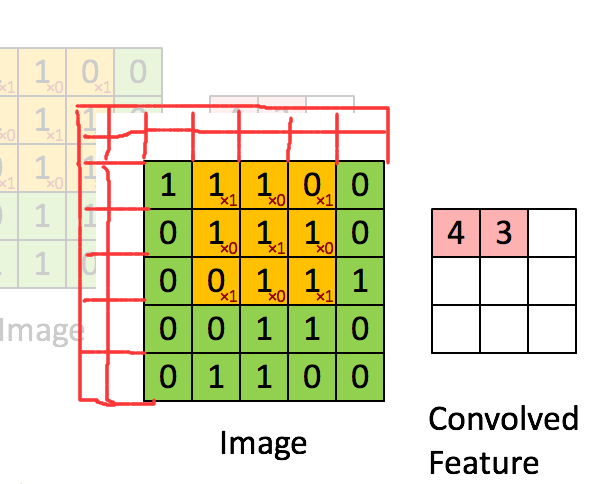

modelsim仿真波形，如下3行数据

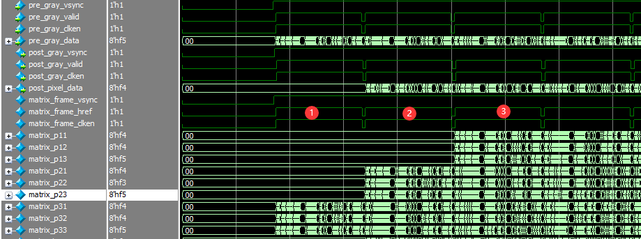

输入3行部分数据

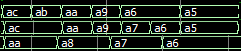

第一行数据波形

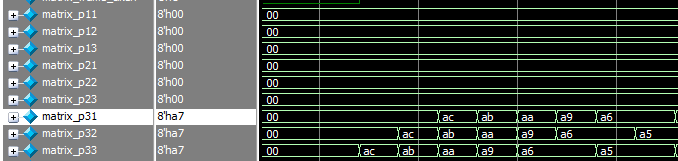

3行全部输入数据波形

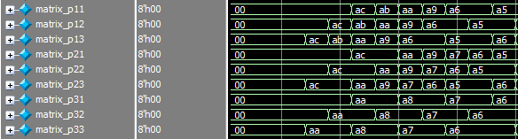

验证无误

后续使用例化两个ram来生成3*3矩阵，便于不同平台的移植

### sobel边沿检测：

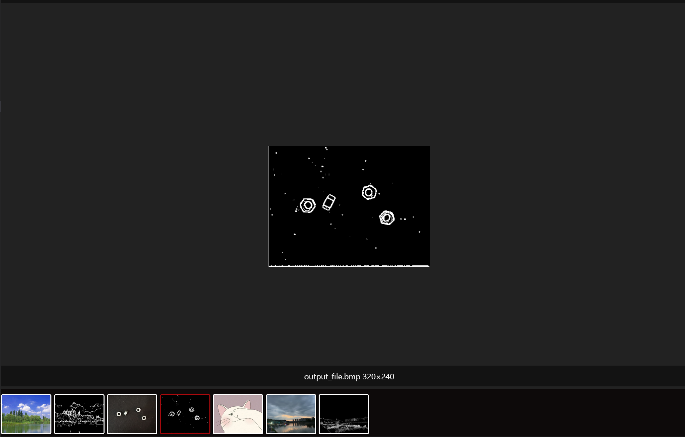

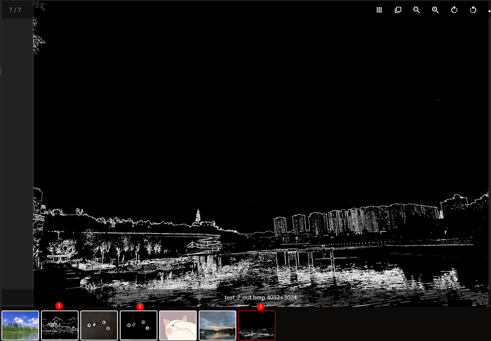

### 中值滤波：

加入中值滤波模块

* 红圈1为原始bmp图片
* 红圈2为bmp（RGB）-YUV-中值滤波后的图像
* 红圈3为bmp（RGB）-YUV-中值滤波-sobel边沿检测后的图像
* 红圈4为bmp（RGB）-YUV-sobel边沿检测中值滤后的图像

分别可进行对比观看效果

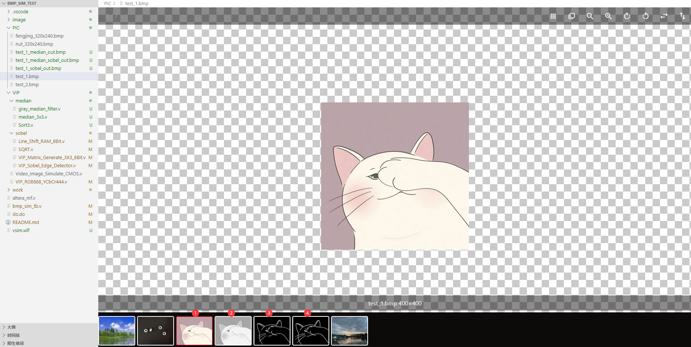
